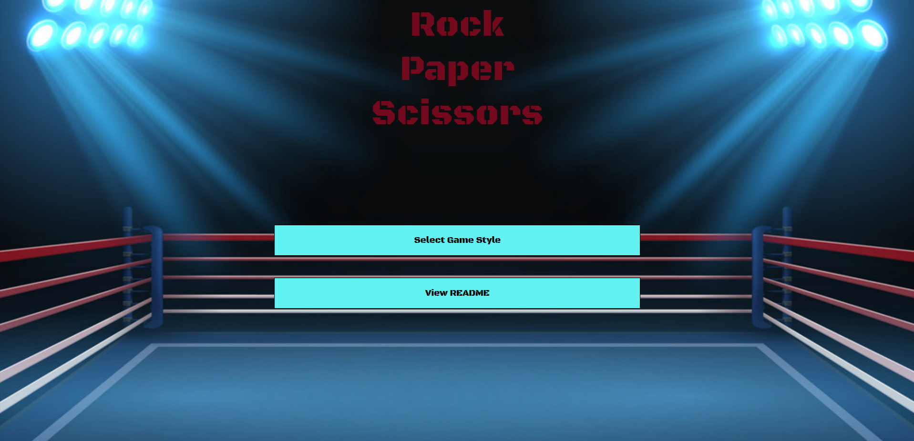
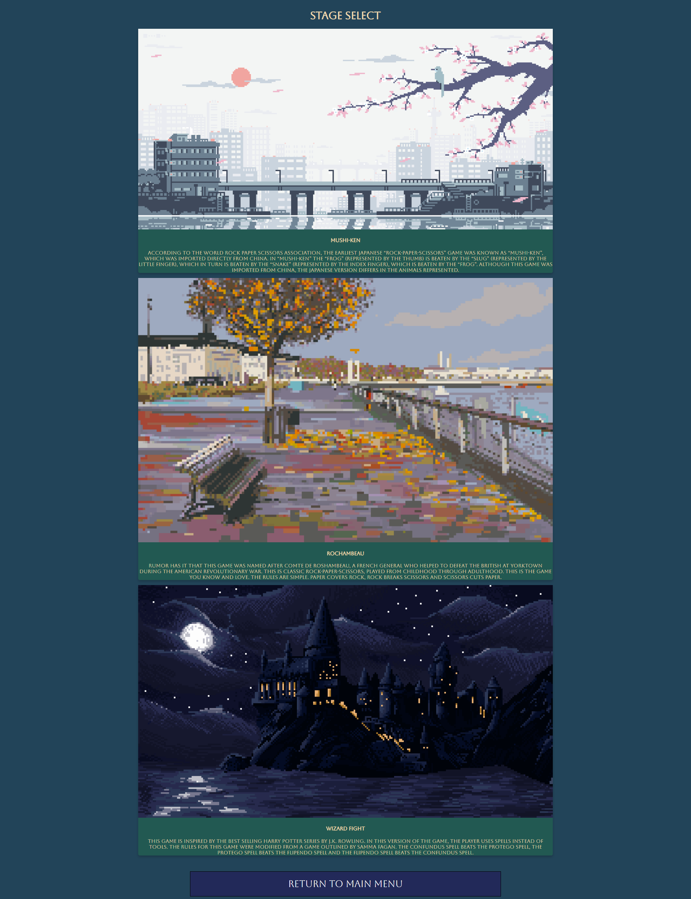
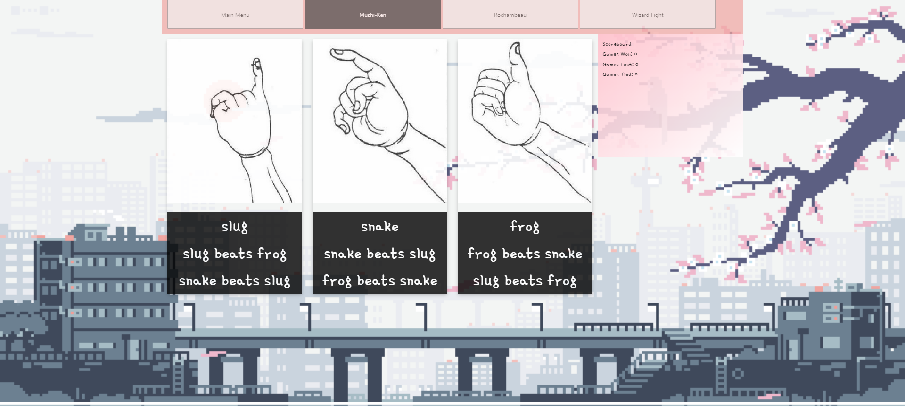

# Rock-Paper-Scissors

This is a website devoted to playing three variations of rock-paper-scissors against a computer opponent. This project was inspired by a much simpler rock-paper-scissors game I made during my coding bootcamp. I hope you have fun playing this game!

I made this game using only methods and technologies I had learned during the initial javascript module in order to reinforce my understanding of vanilla javascript. These restrictions also meant I could not import or export functions, so there is a ton of repeated code. Please see my other work for better, cleaner code.

# How To Use
This is the welcome screen for the application, you can either choose to view this readme,  or select a game style, which will take you to our stage select screen.

On the stage select screen, you can scroll down to view all available play types. Click the image of the game you would like to play to launch that game. You may also return to the main menu by clicking on the button on the bottom of the page.

Once in the game screen, you can switch between styles by using the menu at the top of the page. You may also use that menu to return to the main menu. To play the game click on the image that coresponds with your choice. The rules of each game are explained on the game page. A scoreboard on the right side of the page will keep track of how many games you win. When you select an option, a pop-up window will inform you of the outcome.

# Credits
I own none of the assets used in this project. I have included links to their source here to give credit to the fantastic creaters out there that are making life easier for developers like me. It is my understanding that all of the assets are open-source. If you are the owner of any asset used, and you would not like me to use your work for any reason, please email me at adamwagh@gmail.com. Everyone is free to use this software as they see fit, all I would ask is that you continue to credit these artists.

All non-standard fonts - https://fonts.google.com

favicon - https://icons8.com/

Adobe Color - https://color.adobe.com/create/image

All music and sound effects - https://www.zapsplat.com/

Technology badges - https://github.com/Ileriayo/markdown-badges

Wizard Fight Rules - https://www.pinterest.com/pin/2744449745788236/

Welcome Page background - https://imgflip.com/memetemplate/265390547/boxing-ring

Japanese Background - https://www.pinterest.com/pin/715157615812360797/

French background - https://www.behance.net/gallery/29170423/bOrdogif

Hogwarts background - https://www.pixilart.com/art/hogwarts-c54917a56a375fc

Mushi-ken images - https://en.wikipedia.org/wiki/Sansukumi-ken#/media/File:Mushi-ken_(%E8%99%AB%E6%8B%B3),_Japanese_rock-paper-scissors_variant,_from_the_Kensarae_sumai_zue_(1809).jpg

Wizard fight images - https://harrypotter.fandom.com/wiki/Main_Page

Rochambaue images - https://www.vecteezy.com/free-vector/rock-paper-scissors

# License
MIT License

Copyright (c) 2023 adamwagh512

Permission is hereby granted, free of charge, to any person obtaining a copy
of this software and associated documentation files (the "Software"), to deal
in the Software without restriction, including without limitation the rights
to use, copy, modify, merge, publish, distribute, sublicense, and/or sell
copies of the Software, and to permit persons to whom the Software is
furnished to do so, subject to the following conditions:

The above copyright notice and this permission notice shall be included in all
copies or substantial portions of the Software.

THE SOFTWARE IS PROVIDED "AS IS", WITHOUT WARRANTY OF ANY KIND, EXPRESS OR
IMPLIED, INCLUDING BUT NOT LIMITED TO THE WARRANTIES OF MERCHANTABILITY,
FITNESS FOR A PARTICULAR PURPOSE AND NONINFRINGEMENT. IN NO EVENT SHALL THE
AUTHORS OR COPYRIGHT HOLDERS BE LIABLE FOR ANY CLAIM, DAMAGES OR OTHER
LIABILITY, WHETHER IN AN ACTION OF CONTRACT, TORT OR OTHERWISE, ARISING FROM,
OUT OF OR IN CONNECTION WITH THE SOFTWARE OR THE USE OR OTHER DEALINGS IN THE
SOFTWARE.
